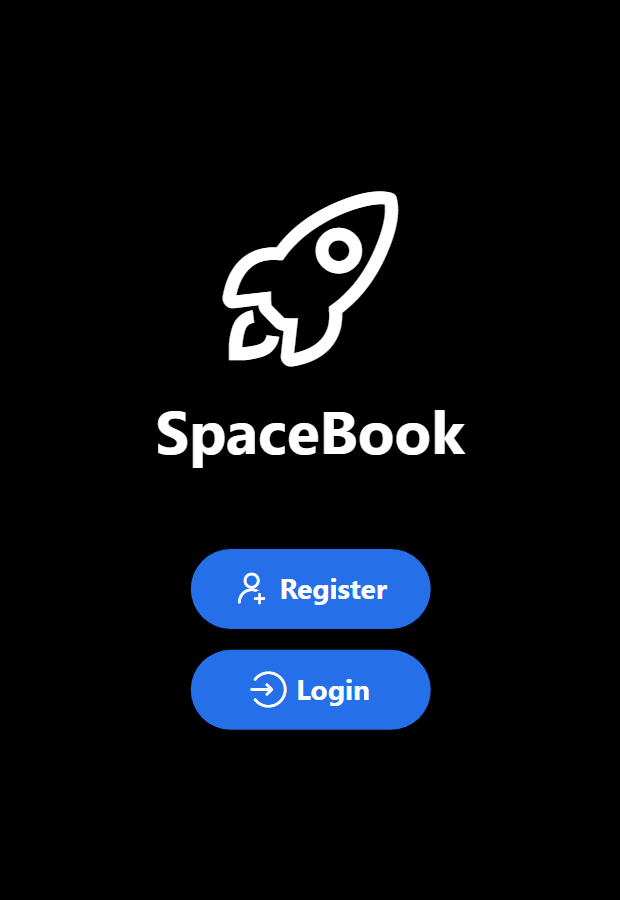
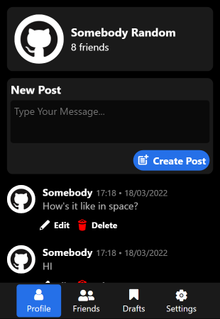
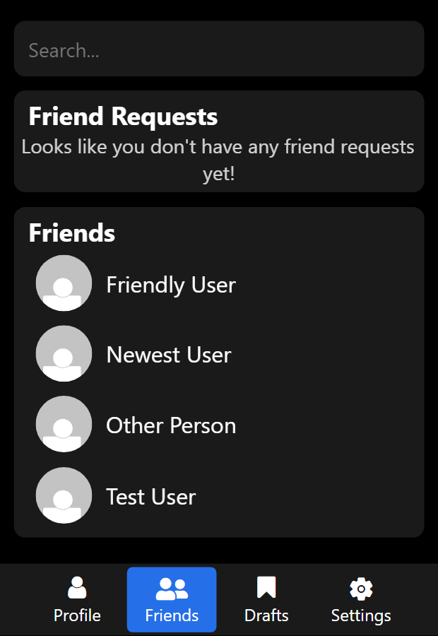
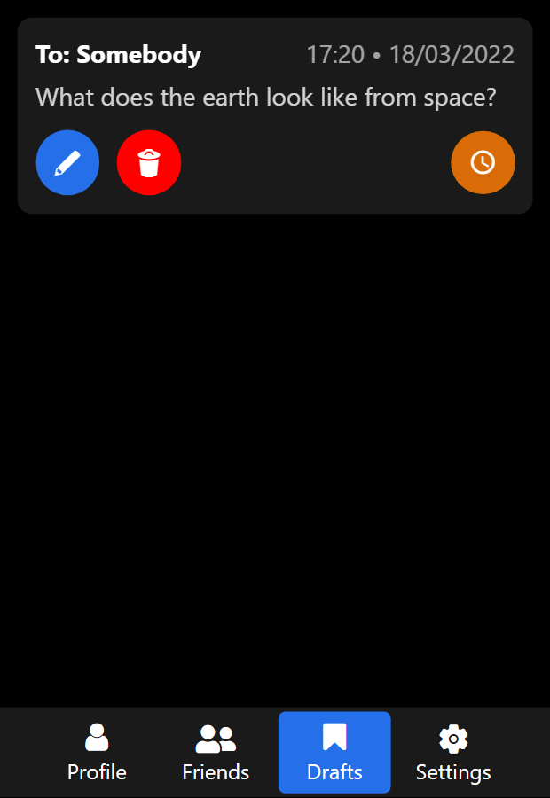
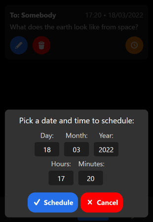
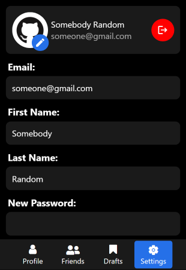

# SpaceBook Mobile React Native App

Link to this repository: https://github.com/mjahmed123/SpaceBookMobile

## Description
Spacebook is a totally unique, non-plagiarised social media platform which allows astronauts to communicate with each other.

## Backend Setup
Refer to this repos readme to setup the backend: https://github.com/ash-williams/Spacebook

## Backend Post Scheduler Setup
Refer to this repos readme to setup the post scheduler: https://github.com/mjahmed123/SpaceBookSchedulingAPI

## Frontend Setup
1. Clone this repo using the command `git clone https://github.com/mjahmed123/SpaceBookMobile.git`
2. Navigate to the directory using `cd SpaceBookMobile`
3. Run `npm install` to install the required dependencies.
4. Run `npm run web` to serve the app locally.
The app should automatically open in your default browser.

## Routes To Implement:

### User Managment
- [x] POST /user
- [x] POST /login
- [x] POST /logout
- [x] GET /user/{user_id}
- [x] PATCH /user/{user_id}
- [x] GET /user/{user_id}/photo
- [x] POST /user/{user_id}/photo

### Friend Managment
- [x] GET /user/{user_id}/friends
- [x] POST /user/{user_id}/friends
- [x] GET /friendrequests
- [x] POST /friendrequests/{user_id}
- [x] DELETE /friendrequests/{user_id}
- [x] GET /search

### Post Managment
- [x] GET /user/{user_id}/post
- [x] POST /user/{user_id}/post
- [ ] GET /user/{user_id}/post/{post_id}
- Note: The route for getting all posts already fulfills the requirements for this route above.
- [x] DELETE /user/{user_id}/post/{post_id}
- [x] PATCH /user/{user_id}/post/{post_id}
- [x] POST /user/{user_id}/post/{post_id}/like
- [x] DELETE /user/{user_id}/post/{post_id}/like

## Screenshots

